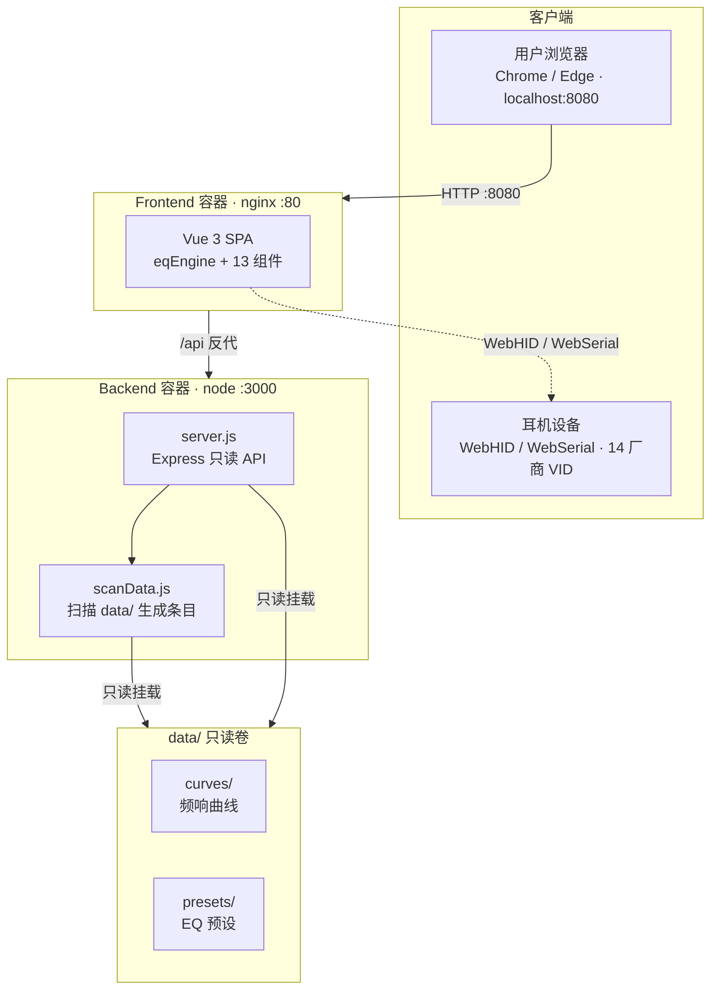
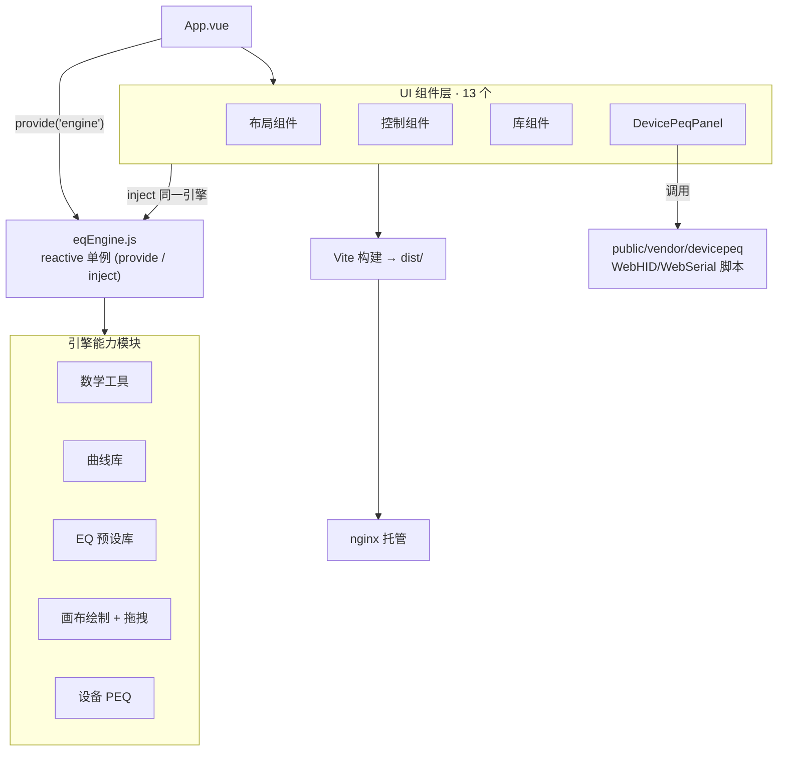

# 🕊️ DOVE EQ WEB · 架构文档

> 鸽子耳机自由曲线绘制者 —— 基于 **Vue 3 + Vite** 的耳机 EQ 均衡器调音工具，支持手机 / 平板 / 电脑三端自适应，可在频响曲线上实时绘制、拖拽调试 8 段参量均衡（PEQ），并支持曲线库导入、EQ 预设管理、设备 PEQ 直连与失真补偿。

本文档对应交互式大图：

- 系统 / 运行时架构：[`diagrams/eq-system.html`](diagrams/eq-system.html)
- 前端内部模块架构：[`diagrams/eq-frontend.html`](diagrams/eq-frontend.html)

> 两类图均带明暗主题切换，可一键导出 PNG / JPEG / WebP / SVG。

---

## 1. 概览

- **形态**：前后端分离的单仓（monorepo），包含 `frontend` / `backend` / `data` / `scripts` / `docs` 五个部分。
- **托管**：前端构建产物由 nginx 托管，后端仅提供**只读** API。
- **数据**：`data/` 以只读卷挂载进后端容器；**加曲线 / 预设只需丢文件进目录，刷新页面即生效，不需要重建镜像**。
- **设备**：SPA 经 `WebHID` / `WebSerial` 直连耳机，写入 PEQ（仅 Chrome / Edge 桌面版、须 localhost）。

---

## 2. 技术栈

| 层 | 技术 | 说明 |
|----|------|------|
| 前端框架 | Vue 3 + Vite | SPA，组件化 UI |
| 画布 | 原生 SVG + 自研引擎 | 频响曲线绘制、控制点拖拽 |
| 后端 | Node.js + Express | 5 个只读接口，无状态 |
| 运行 | Docker / docker-compose + nginx | 两容器分离部署 |
| 设备通道 | WebHID / WebSerial | 浏览器端直连耳机 PEQ |
| 数据 | CSV / JSON | 只读卷挂载，纳入版本库 |

---

## 3. 系统 / 运行时架构



> 📎 交互式大图：[`diagrams/eq-system.html`](diagrams/eq-system.html)

**请求链与数据流向**

```
浏览器 → localhost:8080 → Frontend 容器(nginx:80) → /api 反代 → Backend 容器(node:3000)
                                                                  └→ scanData.js 扫描
                                                                  └→ 只读挂载 data/ 卷 (curves/ 频响曲线 + presets/ EQ 预设)
SPA ──WebHID/WebSerial──▶ 耳机设备 (14 厂商 VID，仅 Chrome/Edge/localhost)
```

要点：

- 后端仅 5 个**只读**接口，每次请求重读磁盘、不缓存。
- 加曲线 / 预设只丢文件进 `data/` 刷新即生效、**免重建镜像**。
- nginx 用 Docker DNS 变量反代，后端容器重建无需重启 nginx。

---

## 4. 前端内部模块架构



> 📎 交互式大图：[`diagrams/eq-frontend.html`](diagrams/eq-frontend.html)

**模块与依赖**

- `App.vue` 通过 `provide('engine')` 注入 **`eqEngine.js`（reactive 单例）**。
- 引擎能力模块：数学工具 / 曲线库 / EQ 预设库 / 画布绘制 + 拖拽 / 设备 PEQ。
- UI 组件层（13 个）：布局 / 控制 / 库 / `DevicePeqPanel` 等，均 `inject` 同一引擎实例，避免状态分裂。
- `Vite` 构建 → `dist/` → nginx；底层设备能力调用 `public/vendor/devicepeq` 的 WebHID / WebSerial 脚本。

---

## 5. 数据流

1. 浏览器请求 `localhost:8080` → nginx 返回 SPA 静态资源。
2. SPA 调用 `/api/*` → nginx 反代到 `backend:3000`。
3. `backend` 的 `scanData.js` 扫描 `data/` 卷，每次请求重读磁盘生成条目。
4. 前端渲染频响曲线 / EQ 预设。
5. 设备直连：SPA 经 `WebHID` / `WebSerial` 读写耳机 PEQ（需 localhost + Chrome/Edge）。

---

## 6. 设计要点

| 要点 | 说明 |
|------|------|
| 只读后端 + 无缓存 | 改 `data/` 刷新页面即生效，无需重启服务 |
| `data/` 独立只读卷 | 加数据免重建镜像，运维成本低 |
| nginx Docker DNS 反代 | 后端容器重建无需重启 nginx |
| 引擎单例 + `provide/inject` | 13 个组件共享同一 `eqEngine`，状态一致 |
| SPA 与浏览器分离建模 | 准确反映「SPA 既在浏览器跑、又经 nginx 取静态 / 调 /api」的真实关系 |

---

## 7. 图表资源

| 文件 | 说明 |
|------|------|
| [`diagrams/eq-system.html`](diagrams/eq-system.html) | 系统 / 运行时架构交互图 |
| [`diagrams/eq-system.architecture.json`](diagrams/eq-system.architecture.json) | 上述图的源规格 |
| [`diagrams/eq-frontend.html`](diagrams/eq-frontend.html) | 前端内部模块架构交互图 |
| [`diagrams/eq-frontend.architecture.json`](diagrams/eq-frontend.architecture.json) | 上述图的源规格 |

---

## 8. 如何重新生成图表

图表由 [archify](https://github.com/tt-a1i/archify) 渲染。修改 `.architecture.json` 后重渲染：

```bash
NODE=/path/to/node
SKILL=/path/to/archify4workbuddy__skillhub   # skillhub 管理的 archify
$NODE "$SKILL/renderers/architecture/render-architecture.mjs" \
      diagrams/eq-system.architecture.json diagrams/eq-system.html
$NODE "$SKILL/renderers/architecture/render-architecture.mjs" \
      diagrams/eq-frontend.architecture.json diagrams/eq-frontend.html
```

---

## 9. 相关文档

- [../README.md](../README.md) —— 快速开始、数据管理、设备直连、排障
- [plans/](plans/) —— 设计文档
